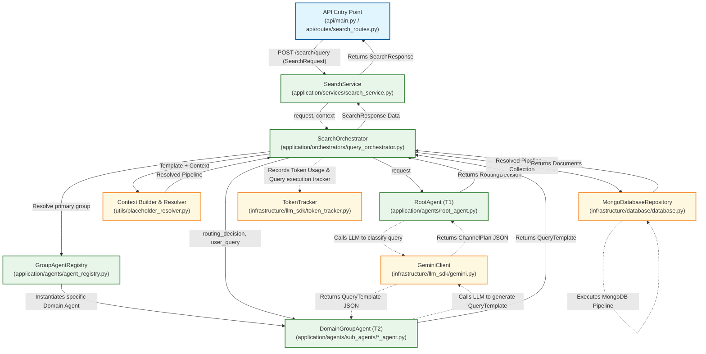

# Architecture & Execution Flow Guide

This document illustrates the complete path of a user query conceptually: from the API entry point to the orchestrators, through the agent layers, to the database, and finally back to the API.

## Execution Flowchart

---

## Detailed File Explanations

### 1. API Layer
- **`api/main.py` & `api/routes/search_routes.py`**
  This is the entry point of the FastAPI application. It defines the HTTP endpoints (like `POST /api/v1/ai/ask`). It receives the raw HTTP request containing the natural language query, `tenantId`, and `userId`, validates it against the `SearchRequest` Pydantic model, and passes it to the `SearchService`.

### 2. Application Layer
- **`application/services/search_service.py`**
  Acts as the bridge between the API routes and the core business logic. It initiates the search process by calling the `SearchOrchestrator` and formats the final `SearchResponse` (including success flags, data, metadata, and error handling) to be returned to the client.

- **`application/orchestrators/query_orchestrator.py`**
  The central coordinator of the entire system. 
  1. Calls the `RootAgent` to classify the intent.
  2. Uses the `GroupAgentRegistry` to find the correct `DomainGroupAgent`.
  3. Commands the `DomainGroupAgent` to generate a database query template.
  4. Resolves the template placeholders into a final MongoDB aggregation pipeline.
  5. Executes the pipeline against the database and logs the execution tracking details to `logs/query_tracker_YYYY-MM-DD.jsonl`.

- **`application/agents/root_agent.py` (T1 Agent)**
  The Tier 1 (T1) AI agent responsible for **Intent Classification**. It takes the raw user query and prompts the Gemini LLM to decide which domain "group" (e.g., Inspections, Tasks, Workflows) the query belongs to. It outputs a `RoutingDecision`. It explicitly raises exceptions if the LLM fails, ensuring no silent failures.

- **`application/agents/agent_registry.py`**
  A simple registry/factory pattern that takes the group name output completely from the `RootAgent` (like "INSPECTION") and returns the corresponding initialized `DomainGroupAgent` (like `InspectionGroupAgent`).

- **`application/agents/sub_agents/domain_base_agent.py` & specific sub-agents (T2 Agents)**
  The Tier 2 (T2) domain-specific AI agents. `DomainBaseAgent` holds the core prompt-loading and LLM-generation logic. Specific subclasses (like `InspectionGroupAgent`) define their specific domains. They take the routing context and the user query to generate a `QueryTemplate` containing a MongoDB aggregation pipeline featuring placeholders (like `"{tenantId}"`).

### 3. Infrastructure & Utilities Layer

- **`utils/placeholder_resolver.py`**
  Takes the raw `QueryTemplate` and runtime context (`tenantId`, `userId`, time windows) and safely replaces the string placeholders with actual Python objects/values so that PyMongo can execute the query successfully.

- **`infrastructure/llm_sdk/gemini.py`**
  A wrapper around the Google Gemini API. It handles formatting prompts, attaching system instructions, and ensuring the LLM response is returned as parsable JSON.

- **`infrastructure/database/database.py`**
  Manages the MongoDB database connection asynchronously using Motor, providing the `db` instance used by the orchestrator to run the final aggregation pipelines.

- **`infrastructure/llm_sdk/token_tracker.py`**
  A utility to monitor and accumulate the number of tokens consumed by the LLM (both prompt and output tokens) across multiple sub-agent calls during a single request flow.
